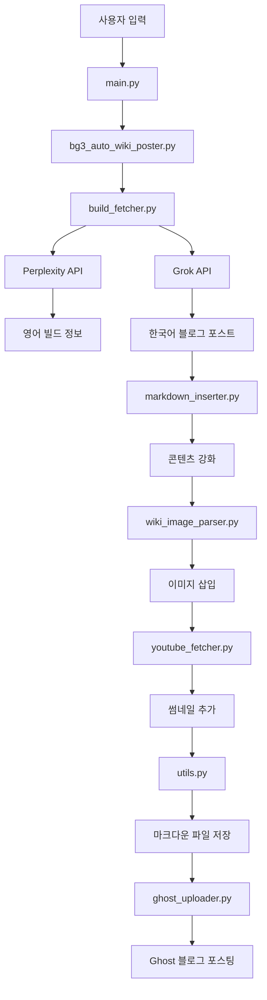

# 🔥 BG3 빌드 가이드 자동 생성기 - 코드 흐름 분석

## 📋 프로젝트 개요

**목적**: Baldur's Gate 3 빌드 정보를 자동으로 수집하고 한국어 가이드를 생성하여 Ghost 블로그에 포스팅하는 시스템

**주요 기능**:

- Perplexity API를 통한 영어 빌드 정보 자동 수집
- Grok API를 통한 한국어 번역 및 블로그 포스트 생성
- Wiki 이미지 자동 검색 및 삽입
- YouTube 썸네일 자동 추가
- Ghost 블로그 자동 포스팅
- 마크다운 파일 자동 저장

---

## 🏗️ 프로젝트 구조

```
Cheat_key/
├── main.py                           # 메인 진입점 (CLI 인터페이스)
├── bg3_auto_wiki_poster.py          # 기존 자동화 워크플로우
├── requirements.txt                  # 의존성 패키지
├── .env                             # 환경변수 (API 키들)
├── bg3_builder/                     # 핵심 모듈들
│   ├── __init__.py
│   ├── utils.py                     # 공통 유틸리티 함수들
│   ├── build_fetcher.py             # API 호출 (Perplexity, Grok)
│   ├── ghost_uploader.py            # Ghost 블로그 포스팅
│   ├── wiki_image_parser.py         # Wiki 이미지 검색 및 삽입
│   ├── youtube_fetcher.py           # YouTube 썸네일 처리
│   ├── markdown_inserter.py         # 마크다운 콘텐츠 강화
│   ├── skill_extractor.py           # BG3 용어 추출
│   ├── simple_build_generator.py    # 간단한 빌드 생성 시스템
│   ├── enhanced_build_generator.py  # 강화된 빌드 생성 시스템
│   ├── accurate_build_generator.py  # 정확도 개선 시스템
│   ├── perplexity_image_extractor.py # Perplexity 기반 이미지 추출
│   ├── enhanced_perplexity_extractor.py # 강화된 Perplexity 추출기
│   ├── simple_perplexity_extractor.py   # 간단한 Perplexity 추출기
│   ├── dynamic_image_system.py      # 동적 이미지 시스템
│   ├── improved_image_system.py     # 개선된 이미지 시스템
│   └── final_dynamic_generator.py   # 최종 동적 생성기
└── 테스트 파일들/                    # 각종 테스트 스크립트들
```

---

## 🚀 코드 실행 흐름

### 1. 메인 진입점: `main.py`

**역할**: 사용자 인터페이스 제공 및 워크플로우 선택

- 메뉴 기반 CLI 인터페이스 제공
- 여러 빌드 생성 시스템 중 선택 가능
- Ghost 블로그 포스팅 여부 선택

**주요 함수**:

- `show_menu()`: 메뉴 표시
- `simple_system_workflow()`: 간단한 시스템 워크플로우
- `get_perplexity_file()`: Perplexity 파일 선택

**흐름**:

```
사용자 입력 → 메뉴 선택 → 워크플로우 실행 → 결과 표시
```

### 2. 기존 워크플로우: `bg3_auto_wiki_poster.py`

**역할**: 전체 자동화 프로세스 조율

- 각 단계별 모듈 호출 및 연결
- 오류 처리 및 로깅
- 실행 시간 측정

**주요 함수**:

- `automate_build_guide()`: 메인 자동화 프로세스
- `get_user_input()`: 사용자 입력 받기
- `extract_title()`: 마크다운 제목 추출

**실행 단계**:

```
1. 빌드 정보 수집 (Perplexity API)
2. 한국어 번역 (Grok API)
3. 콘텐츠 강화 (요약 카드, 전투 루틴)
4. 이미지 삽입 (Wiki + Perplexity)
5. YouTube 썸네일 추가
6. 마크다운 파일 저장
7. Ghost 블로그 포스팅
```

---

## 🔧 핵심 모듈별 상세 분석

### 3. API 호출: `bg3_builder/build_fetcher.py`

**역할**: 외부 API를 통한 데이터 수집

- Perplexity API로 영어 빌드 정보 수집
- Grok API로 한국어 번역 및 블로그 포스트 생성
- API 응답 저장 및 오류 처리

**주요 함수**:

- `get_perplexity_response()`: Perplexity API 호출
- `get_grok_response()`: Grok API 호출
- `get_build_info()`: 빌드 정보 수집
- `create_korean_blog_post()`: 한국어 블로그 포스트 생성

**API 설정**:

- **Perplexity**: `sonar-reasoning-pro` 모델 사용
- **Grok**: `grok-3-beta` 모델 사용
- 환경변수에서 API 키 로드

### 4. 공통 유틸리티: `bg3_builder/utils.py`

**역할**: 전체 프로젝트에서 사용하는 공통 기능

- 로깅 설정
- 환경변수 로드
- 파일명 생성
- 마크다운 파일 저장
- **문장 끝 줄바꿈 처리** (최근 수정)

**주요 함수**:

- `setup_logging()`: 로깅 설정
- `load_env_vars()`: 환경변수 로드
- `save_to_markdown()`: 마크다운 파일 저장
- `add_newlines_after_sentences()`: 문장 끝 줄바꿈 추가
- `generate_filename()`: 안전한 파일명 생성

### 5. Ghost 블로그: `bg3_builder/ghost_uploader.py`

**역할**: Ghost 블로그에 자동 포스팅

- JWT 토큰 기반 인증
- 마크다운을 HTML로 변환
- 요약 카드 제거
- **문장 끝 줄바꿈 처리** (최근 수정)

**주요 클래스 및 함수**:

- `GhostAPI`: Ghost API 클래스
  - `_create_jwt_token()`: JWT 토큰 생성
  - `_convert_markdown_to_html()`: 마크다운→HTML 변환
  - `create_post()`: 포스트 생성
- `post_to_ghost_blog()`: 메인 포스팅 함수

**최근 개선사항**:

- 마크다운 변환 시 문장 끝 줄바꿈 자동 추가
- `strip()` 대신 `lstrip()` 사용으로 줄바꿈 보존

### 6. 이미지 처리: `bg3_builder/wiki_image_parser.py`

**역할**: BG3 Wiki에서 이미지 검색 및 삽입

- 마크다운에서 BG3 용어 추출
- BG3 Wiki 검색
- 이미지 URL 추출 및 삽입

**주요 함수**:

- `extract_skill_item_names()`: 스킬/아이템 이름 추출
- `get_image_url_from_wiki()`: Wiki 이미지 URL 가져오기
- `insert_images_to_markdown()`: 마크다운에 이미지 삽입
- `is_valid_bg3_term()`: BG3 용어 유효성 검증

### 7. YouTube 처리: `bg3_builder/youtube_fetcher.py`

**역할**: YouTube에서 빌드 관련 썸네일 가져오기

- YouTube 검색
- 썸네일 URL 추출
- 마크다운에 썸네일 삽입

**주요 함수**:

- `get_build_thumbnail()`: 빌드 썸네일 가져오기
- `add_youtube_thumbnail_to_markdown()`: 마크다운에 썸네일 추가

### 8. 마크다운 강화: `bg3_builder/markdown_inserter.py`

**역할**: 마크다운 콘텐츠 강화 및 구조화

- 빌드 정보 추출
- 요약 카드 생성 (현재 비활성화)
- 전투 루틴 섹션 생성
- 주문/스킬 정보 추출

**주요 함수**:

- `extract_build_info()`: 빌드 정보 추출
- `extract_spells()`: 주문/스킬 추출
- `create_combat_routine()`: 전투 루틴 생성
- `enhance_markdown_content()`: 마크다운 콘텐츠 강화

---

## 🔄 빌드 생성 시스템들

### 9. 간단한 시스템: `bg3_builder/simple_build_generator.py`

**역할**: Perplexity 파일 기반 간단한 빌드 생성

- 기존 Perplexity 응답 파일 재사용
- 간단한 용어 추출
- 빠른 처리 속도

### 10. 강화된 시스템: `bg3_builder/enhanced_build_generator.py`

**역할**: 더 정교한 용어 추출 및 이미지 처리

- 패턴 매칭 강화
- 신뢰도 기반 이미지 선택
- 통계 정보 제공

### 11. 정확도 개선 시스템: `bg3_builder/accurate_build_generator.py`

**역할**: 최고 정확도의 빌드 생성

- 다단계 검증
- 영어-한국어 용어 매핑
- 최신 패턴 매칭

---

## 📊 데이터 흐름



---

## 🔧 주요 설정 파일들

### `.env` 파일

```
PERPLEXITY_API_KEY=your_key_here
GROK_API_KEY=your_key_here
GHOST_ADMIN_API_URL=https://ko.globexfeed.com
GHOST_API_KEY=your_ghost_key_here
GHOST_INTEGRATION_ID=your_integration_id
```

### `requirements.txt`

```
requests
python-dotenv
PyJWT
markdown
beautifulsoup4
```

---

## 🚨 최근 주요 수정사항

### 문장 끝 줄바꿈 처리 개선

- **문제**: 마침표 뒤 줄바꿈이 Ghost 블로그에서 제대로 표시되지 않음
- **해결**:
  1. `utils.py`에서 Markdown 표준 줄바꿈(`  \n`) 사용
  2. `ghost_uploader.py`에서 줄바꿈 함수 호출 추가
  3. `strip()` 대신 `lstrip()` 사용으로 줄바꿈 보존

### 요약 카드 제거

- 사용자 요청에 따라 빌드 요약 카드 생성 기능 비활성화
- HTML 변환 시 기존 요약 카드 완전 제거

---

## 🎯 사용법

### 1. 직접 실행

```bash
python main.py
```

### 2. 커맨드 라인

```bash
python bg3_auto_wiki_poster.py --build "Storm Sorcerer" --no-post
```

### 3. 테스트 모드

```bash
python bg3_auto_wiki_poster.py --test --build "Test Build"
```

---

## 📈 시스템 발전 과정

1. **초기 버전**: 기본적인 API 호출 및 번역
2. **이미지 시스템 추가**: Wiki 이미지 자동 삽입
3. **다중 시스템**: 간단/강화/정확도 개선 시스템 분리
4. **성능 최적화**: Perplexity 파일 재사용 시스템
5. **사용자 경험 개선**: 줄바꿈 처리, 요약 카드 제거

---

## 🔮 향후 개선 방향

- [ ] 더 정교한 BG3 용어 데이터베이스 구축
- [ ] 이미지 품질 자동 검증 시스템
- [ ] 다국어 지원 확장
- [ ] 웹 인터페이스 추가
- [ ] 실시간 패치 정보 반영

**추천 커밋 메시지**: `docs: BG3 빌드 생성기 전체 코드 흐름 및 아키텍처 문서화`
